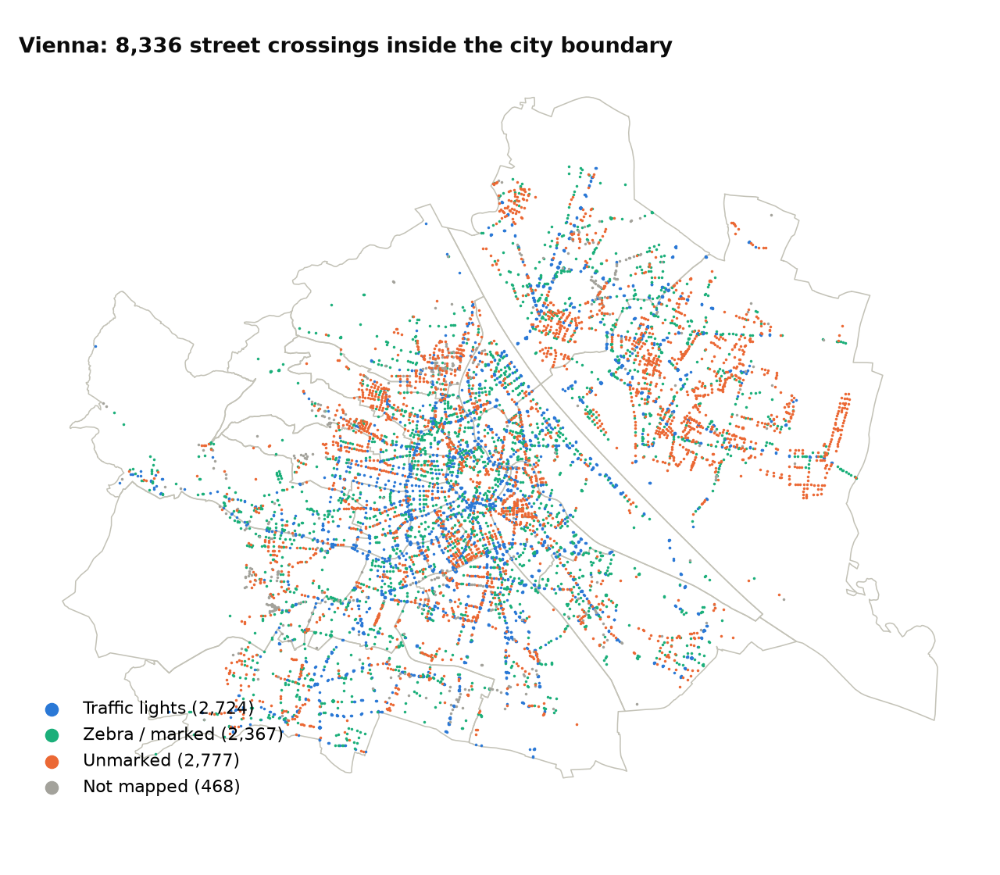
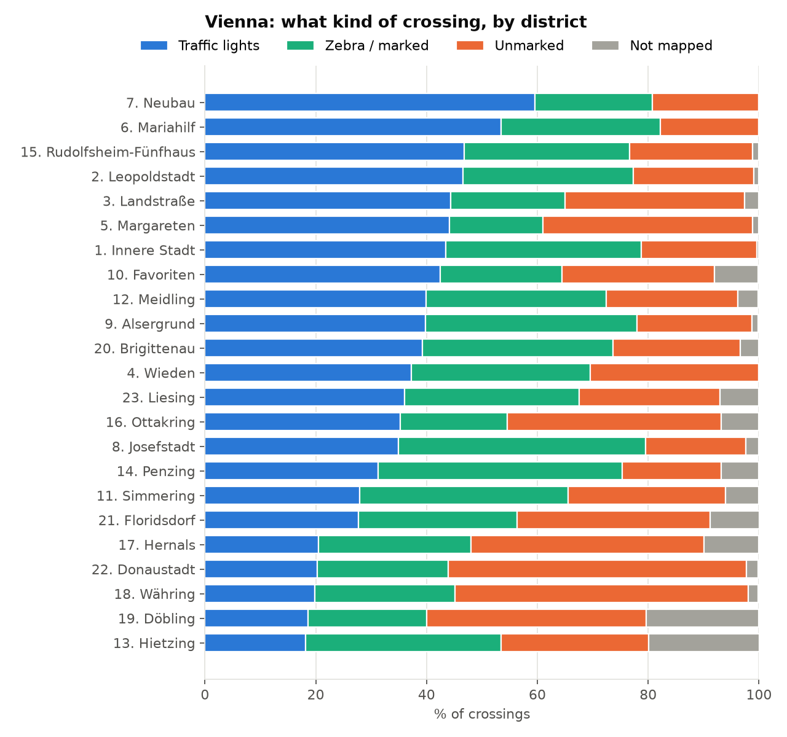
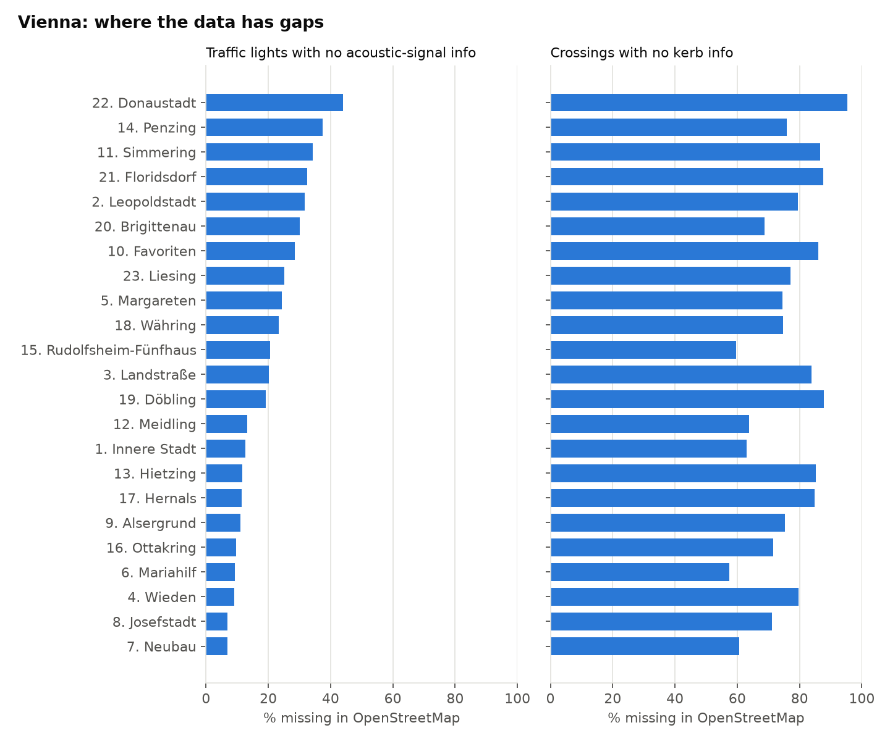
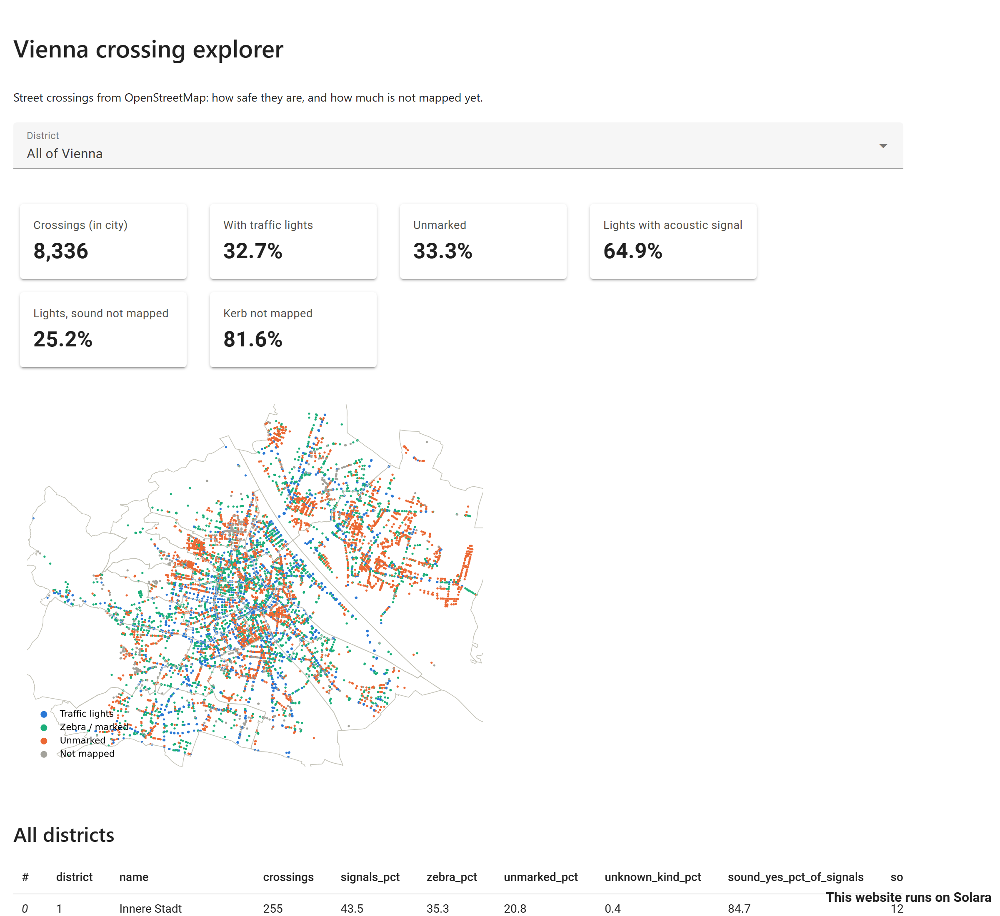

# Crossing Data Explorer

[](https://github.com/ardapkr/crossing-data-explorer/actions/workflows/ci.yml)

How safe are Vienna's street crossings for blind and wheelchair users, and how much of that can we actually
know from open data? A pandas analysis of **21,468 OpenStreetMap nodes** from Vienna and Budapest, with tests
for every cleaning rule and a small Solara dashboard.

It grew out of [Crosswise](https://github.com/ardapkr/crosswise), a navigation app I built at a hackathon that
picks the route with the safest crossings. The app needed this data cleaned. This repo looks at the data itself.

Python · pandas · scikit-learn · shapely · matplotlib · Solara · pytest · GitHub Actions



## Findings

| | Vienna | Budapest |
|---|---:|---:|
| Crossings (after cleaning) | 8,987 | 7,257 |
| With traffic lights | 32.1% | 35.4% |
| Unmarked | 32.4% | 22.4% |
| Traffic lights **with** an acoustic signal for blind people | 61.9% | 23.7% |
| Traffic lights where the acoustic signal is **not mapped** | 27.7% | 42.5% |
| Crossings with no kerb information | 81.7% | 82.1% |

- **The centre is well equipped, the outskirts are not.** In Neubau (7th) 60% of crossings have lights and
  83% of those have an acoustic signal. In Donaustadt (22nd) it is 20% and 52%, and over half the crossings are unmarked.
- **Missing data is the bigger problem.** Kerb height, the thing a wheelchair user needs most, is missing for
  82% of crossings in both cities. In Donaustadt 44% of traffic lights have no sound information at all. A route
  planner has to say "unknown" here, not guess. (The Crosswise app fills some kerb gaps from separate `barrier=kerb`
  nodes; this analysis uses only the crossing nodes.)
- **Budapest has more lights but far fewer acoustic signals mapped** (24% vs 62%), and many more unknowns.




All numbers: [docs/tables.md](docs/tables.md) and [docs/vienna-districts.csv](docs/vienna-districts.csv).

## How the cleaning works

```
raw OSM nodes (21,468)
  │ usable()    drop underground (level=-1), private, "crossing=no", tram/emergency signals
  ▼ 21,169
  │ classify()  messy tags → kind (signals / zebra / unmarked / unknown), sound, kerb, tactile, island
  │             unclear values like "yes;no" become unknown, never a guess
  ▼
  │ group()     one intersection can have up to 18 nodes → merge nodes within 20 m into one crossing,
  │             keeping the best-known value per attribute (except kerbs: "raised" wins, to be safe)
  ▼ 8,987 crossings
  │ assign_districts()  point-in-polygon with a spatial index (shapely STRtree)
  ▼
  quality.summary() / by_district()
```

The code is in [`crossings/`](crossings): `load.py`, `clean.py`, `districts.py`, `quality.py`, each a few short functions.

### Comparing two ways to group nodes

Which nodes belong to the same crossing? I implemented two methods and compared them on Vienna:

| | Greedy (the app's method) | DBSCAN (scikit-learn) |
|---|---:|---:|
| Crossings | 8,987 | 7,667 |
| With traffic lights | 2,888 | 1,779 |
| Largest group | 18 nodes | 70 nodes |

DBSCAN joins nodes that are within 20 m of each other *through a chain*, so along a street with crossings every
15 m it builds one 70-node "crossing" about 150 m across and loses more than a thousand separate signalled
crossings. The greedy method compares each node with a group's **centre**, so its largest group is about 45 m
across (one big intersection). For this problem the simpler method is the right one. A test
(`test_dbscan_chains_but_greedy_does_not`) shows the difference on five points in a line.

## Run it

```bash
python -m venv .venv
.venv/Scripts/activate            # Windows (macOS/Linux: source .venv/bin/activate)
pip install -r requirements.txt

pytest                            # 37 tests, ~10 s
python report.py                  # rebuilds the charts and tables in docs/
solara run app.py                 # dashboard on http://localhost:8765
```



## Tests

- `tests/test_clean.py`: each filter rule, each tag → kind rule, kerb mapping, unknown values staying unknown,
  the haversine distance, both grouping methods, "best known value wins" and "raised kerb wins".
- `tests/test_quality.py`: percentages on small hand-made tables, district assignment with two square districts.
- `tests/test_real_data.py`: pins the real-data numbers (21,169 usable nodes, 8,987 crossings, all 23 districts),
  so a rule change that moves the README numbers fails the build.

## Data

- `data/overpass-vienna.json.gz`, `data/overpass-budapest.json.gz`: all `highway=crossing` and
  `highway=traffic_signals` nodes, downloaded from the Overpass API on 26 September 2026.
  © [OpenStreetMap](https://www.openstreetmap.org/copyright) contributors, ODbL.
- `data/vienna-districts.geojson`: district boundaries from [Stadt Wien – data.wien.gv.at](https://data.wien.gv.at)
  (CC BY 4.0), simplified to ~5 m.

## Next steps

- Merge the separate `barrier=kerb` nodes (like the app does) and measure how much kerb coverage that adds
- Budapest districts
- Track coverage over time with older OSM snapshots, to see whether mapping is improving

## License

Code: MIT. Data: see above.
